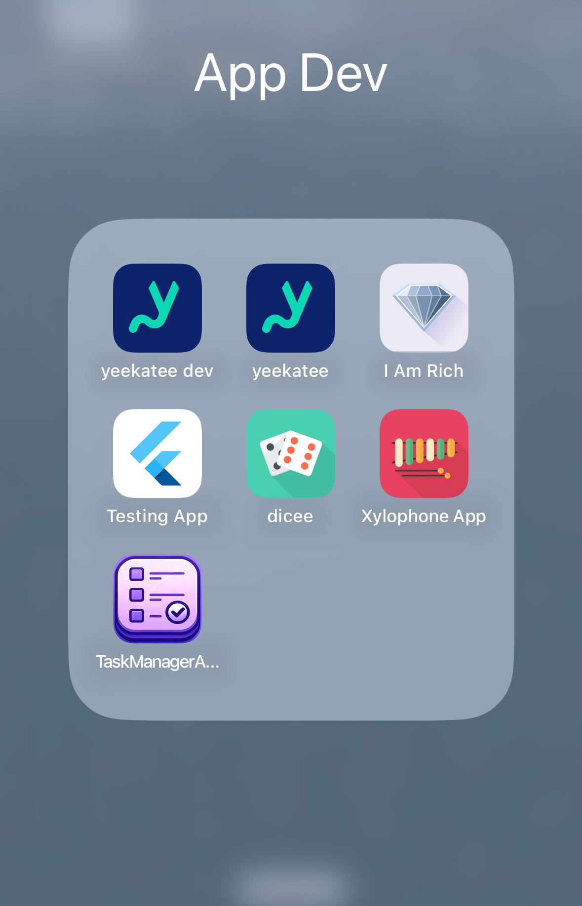

# Simple Task Manager - Flutter App
This is the corresponding Flutter application for the Simple Task Manager, a project that provides functionality for
managing task and is only meant for demo purposes. The app integrates with a backend API and has a matching Angular frontend implementation.


## Implemented functionality
### **Features**
- Simple app that allows to list, create, update and delete tasks
- The app interacts with the task manager API that is deployed in the backend (which includes the infrastructure as well in AWS cdk)
- Next to the task API, I implemented a single User API that allows to list all signed-up users (with pagination and optional username search) 
  which however was not yet implemented fully in this app (only lists the users - no searching)
- The APIs are secured by AWS Cognito that issues an ID Token once the user has signed up and is signed in.
- Supported user authentication flows:
  - Sign-up
  - Sign-in
  - Confirm account via code sent via email
  - Reset password
  - Confirm reset password via code sent via email

### **Technology Stack**
- **Flutter**: Frontend mobile application development (this application).
- **Backend**: [Task Manager Backend](https://github.com/nufki/task-manager-backend).
- **Frontend (Web)**: [Angular Frontend](https://github.com/nufki/task-manager-frontend) (version 18.2).


## Impressions
<div style="display: flex; justify-content: space-evenly; flex-wrap: wrap;">
  
  
  
  
  
  
  
</div>


## **Getting Started**
1. Install [Flutter](https://flutter.dev/docs/get-started/install).
2. Set up your environment for [iOS](https://flutter.dev/docs/get-started/install/macos) or [Android](https://flutter.dev/docs/get-started/install/windows).
3. Ensure you have access to the [backend](https://github.com/nufki/task-manager-backend) API.


### **Installation**
1. Clone the repository:
   ```bash
   git clone https://github.com/nufki/task-manager-flutter.git
   cd task-manager-flutter
   ```
2. Fetch dependencies:
   ```bash
   flutter pub get
   ```
3. Configure the backend API endpoints in the application (if necessary). You can also leave it as is as the default points to my running backend. ;-)
  - Otherwise customize your endpoints in the `.env` when you deployed your version of the backend.


### **Running the App**
1. To run on a connected device or emulator:
   ```bash
   flutter run
   ```
2. To build for release:
   ```bash
   flutter build ios  # For iOS
   flutter build apk  # For Android
   ```


## **Project Components**

### **Backend**
The app communicates with the backend API for task management operations. Check out the backend source code and documentation here: [Task Manager Backend](https://github.com/nufki/task-manager-backend).

### **Web Frontend**
A corresponding Angular web frontend is also available for this project. To explore or contribute to the web version, visit: [Task Manager Frontend](https://github.com/nufki/task-manager-frontend).

---

## **Contributing**

Contributions are welcome! Please follow these steps:

1. Fork the repository.
2. Create a new branch for your feature or bugfix:
   ```bash
   git checkout -b feature-name
   ```
3. Commit your changes:
   ```bash
   git commit -m "Add a meaningful commit message"
   ```
4. Push to your branch:
   ```bash
   git push origin feature-name
   ```
5. Open a pull request.


## Fastest way to deploy on IOS
1. Initial setup: run: `open ios/Runner.xcworkspace`, set team (yourself probably)
2. Then run this command below running the build above manually on xcode runs it in debug mode only
````
flutter run --release  
````
This command builds and runs your Flutter app on a connected device (physical device or emulator/simulator) in release mode.


## Deployment commands documentation

````
flutter run --release  
````
- Builds the app in release mode and immediately runs it on a connected device in the specified mode (e.g., --release, --debug, --profile)
- Quickly test your app in release mode on a real device or emulator
- It does not generate the .ipa file for distribution
- Does not always perform a clean build. Hence, when changing app icons, `flutter clean` has to be run first!


````
flutter build ios
````
- Builds the iOS app for release, creating an .xcarchive and/or .ipa file for deployment to the App Store or TestFlight.
- Prepares the app for iOS deployment by running Xcode-specific build steps
- Creates build artifacts in the build/ios directory
- This command does not run or install the app on a device
- Does not run a clean, If there are issues related to stale build artifacts, corrupted cache, or changes in resources 
  (like assets, icons, or dependencies), you should manually `run flutter clean` before flutter build ios to ensure a completely fresh build 

