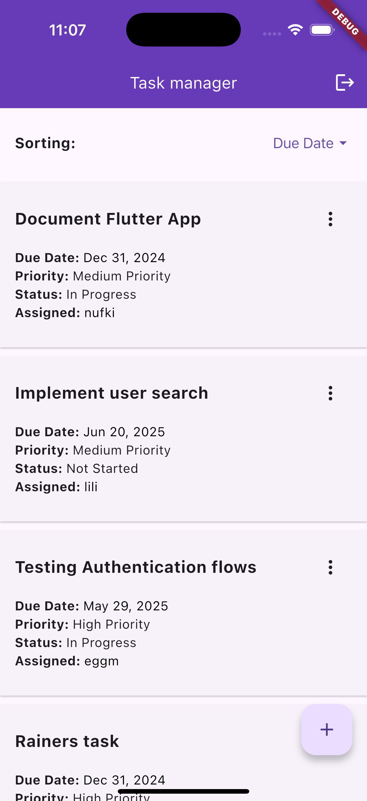
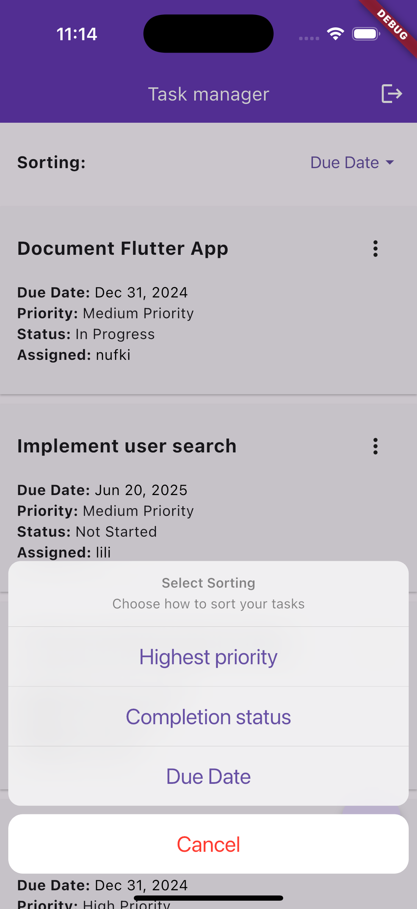
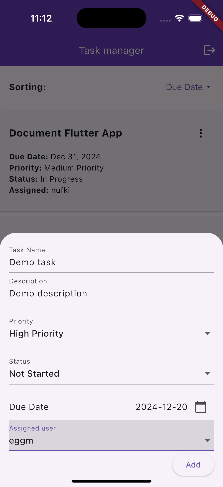
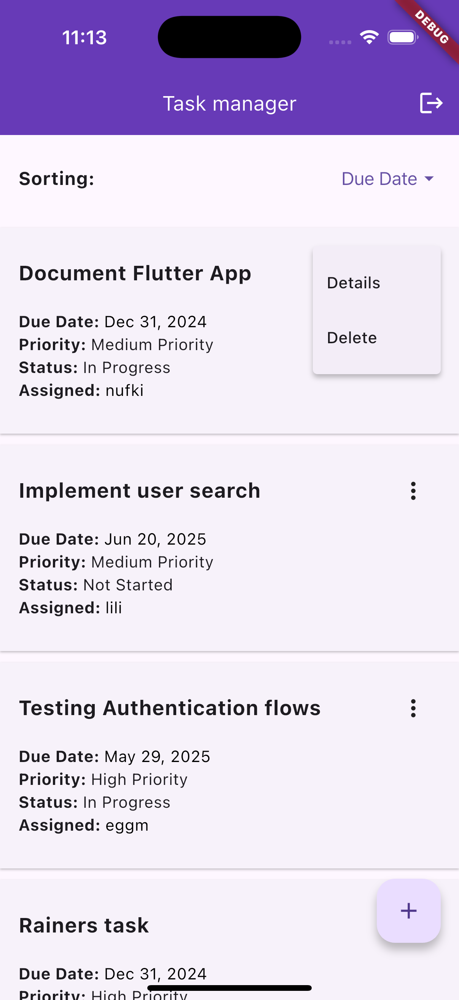
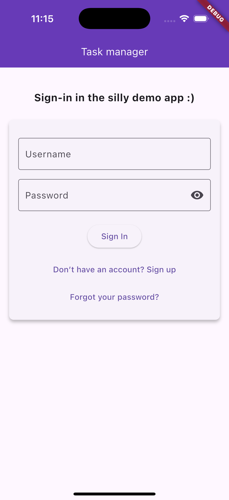
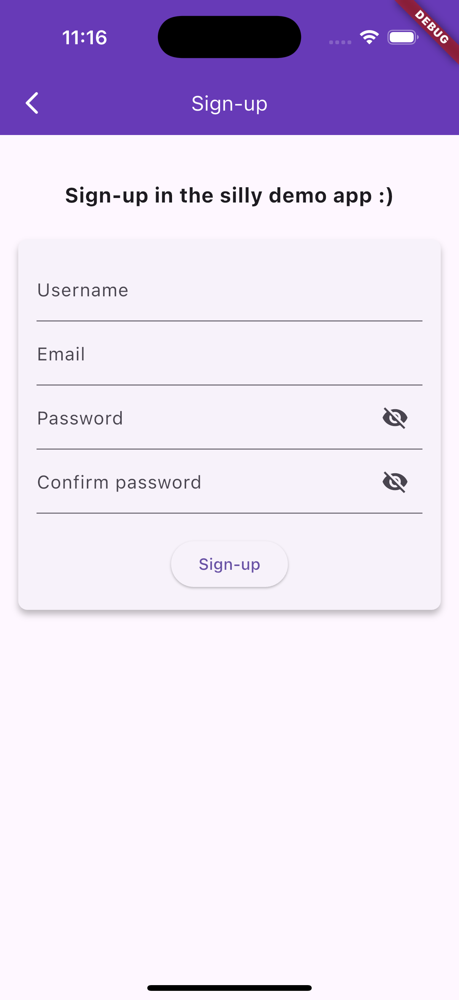

# About
This is the corresponding flutter app of the simple task manager application backend:
https://github.com/nufki/task-manager-backend

I also implemented a matching Anuglar frontend (version 18.2) for this silly task :):
https://github.com/nufki/task-manager-frontend

## Implemented functionality
Features:
- Simple app that allows to list, create, update and delete tasks
- The app interacts with the task manager API that is deployed in the backend (which includes the infrastructure as well in AWS cdk)
- Next to the task API, I implemented a single User API that allows to list all signed-up users (with pagination and optional username search) 
  which however was not yet implemented fully in this app (only lists the users - no searching)
- The APIs are secured by AWS Cognito that issues an ID Token once the user has signed up and is signed in.
- Supported user authentication flows:
  - Sign-up
  - Sign-in
  - Confirm account via code sent via email
  - Reset password
  - Confirm reset password via code sent via email

## Impressions
<div style="display: flex; justify-content: space-evenly; flex-wrap: wrap;">
  
  
  
  
  
  
</div>

## Deploy the app on IOS (native device)
1. Initial setup: run: `open ios/Runner.xcworkspace`, set team (yourself probably)
2. Then run this command below running the build above manually on xcode runs it in debug mode only
````
flutter run --release  
````
This command builds and runs your Flutter app on a connected device (physical device or emulator/simulator) in release mode.

